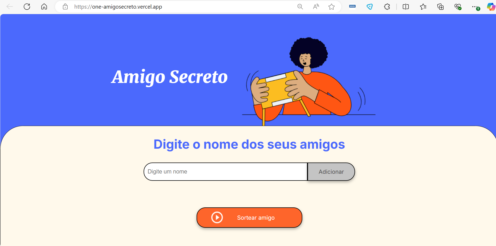

<h1 align="center"> Challenges ONE - Amigo Secreto  </h1>
Author - James Bianchi

<h4 align="center"> 
    :construction:  Projeto em construção  :construction:
</h4>

<h1 align="">Descrição do Projeto: </h1>

Esta pequena aplicação, permite aos usuários inserir nomes de amigos em uma lista para, em seguida, realizar um sorteio aleatório e determinar quem é o "amigo secreto".

O usuário deverá adicionar nomes por meio de um campo de texto e de um botão "Adicionar".

Os nomes inseridos serão exibidos em uma lista visível na página, e ao finalizar, um botão "Sortear Amigo" selecionará um dos nomes de forma aleatória, exibindo o resultado na tela.

OBS. O propósito no desenvolvimento deste aplicativo foi praticar os conceitos adquiridos sobre lógica de programação.

<h1> 🔨Funcionalidades: </h1>

1. Adicionar nomes: Os usuários escreverão o nome de um amigo em um campo de texto e o adicionarão a uma lista visível ao clicar em "Adicionar".

2. Validar entrada: Se o campo de texto estiver vazio, o programa exibirá um alerta solicitando um nome válido.

3. Visualizar a lista: Os nomes inseridos aparecerão em uma lista abaixo do campo de entrada.

4. Sorteio aleatório: Ao clicar no botão "Sortear Amigo", um nome da lista será selecionado aleatoriamente e exibido na página.
5. Após o sorteio de um nome da lista, ao clicar novamente no botão "Sortear Amigo" a aplicação vai se reiniciar.
 

<h1> ✔️ Linguagens utilizadas </h1>

- `JavaScript`
- `Html`
- `Css`

   

<h1> ✔️ Onde acessar a aplicação </h1>

A aplicação poderá ser acessada através do link: https://one-amigosecreto.vercel.app/.

